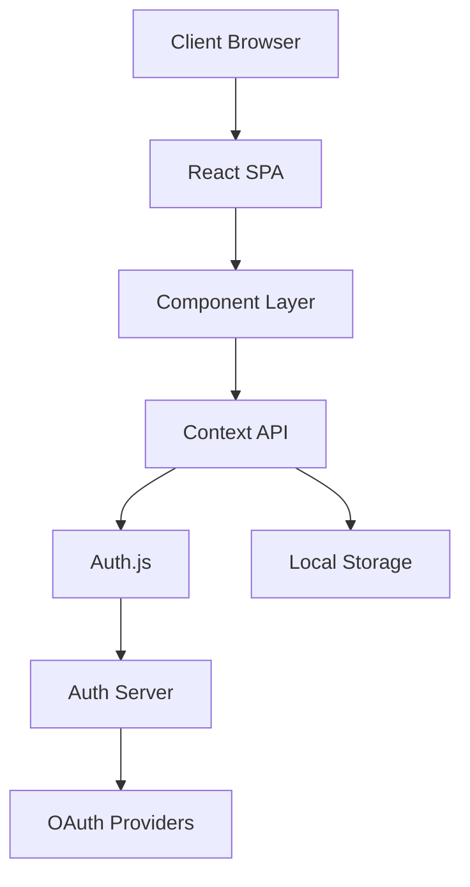
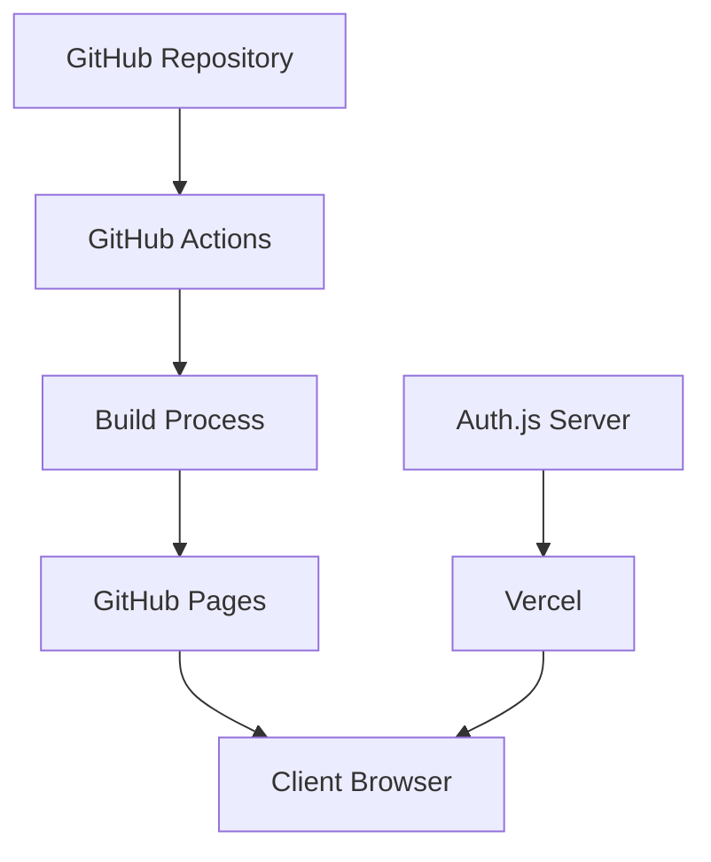

# Architecture Overview

This document provides a high-level overview of the portfolio application's architecture.

## System Architecture

The portfolio is a React-based single-page application (SPA) with the following key architectural components:



### Key Components

1. **React SPA**: The main application built with React and React Router
2. **Component Layer**: Reusable UI components built with Material-UI
3. **Context API**: State management using React Context
4. **Auth.js**: Authentication service
5. **Local Storage**: Client-side data persistence
6. **Auth Server**: External authentication server (deployed on Vercel)
7. **OAuth Providers**: External authentication providers (Google, GitHub)

## Frontend Architecture

The frontend follows a component-based architecture with the following structure:

```
src/
├── components/     # Reusable UI components
├── context/        # React Context providers
├── data/           # Static data and models
├── hooks/          # Custom React hooks
├── pages/          # Page components
├── theme/          # Theme configuration
└── utils/          # Utility functions
```

### Key Design Patterns

1. **Component Composition**: Building complex UIs from smaller, reusable components
2. **Context API**: Managing global state with React Context
3. **Custom Hooks**: Encapsulating reusable logic
4. **Higher-Order Components**: Adding functionality to existing components
5. **Render Props**: Sharing code between components

## Authentication Flow

The authentication flow uses Auth.js with the following steps:

1. User clicks "Sign In" button
2. User is redirected to Auth.js server
3. User selects an OAuth provider (Google or GitHub)
4. User authenticates with the provider
5. Provider redirects back to Auth.js server
6. Auth.js server creates a session
7. User is redirected back to the application
8. Application verifies the session with Auth.js server

## Data Flow

The application uses a combination of static data and dynamic content:

1. **Static Data**: Resume information, skills, certifications
2. **Dynamic Content**: Blog posts, user preferences
3. **Local Storage**: Persisting user data and preferences
4. **API Calls**: Authentication and external services

## Deployment Architecture

The application is deployed using GitHub Pages with the following architecture:



## Performance Considerations

1. **Code Splitting**: Reducing initial load time
2. **Lazy Loading**: Loading components only when needed
3. **Memoization**: Preventing unnecessary re-renders
4. **Image Optimization**: Reducing asset sizes
5. **Caching**: Improving load times for returning users
