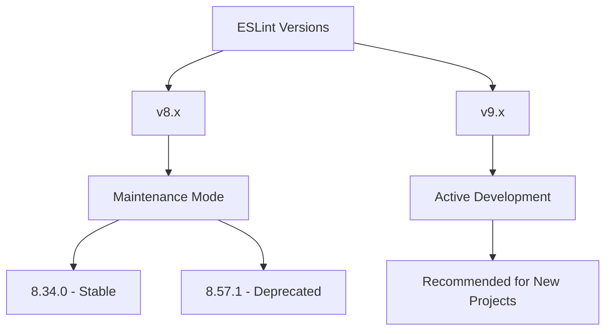

# ESLint Version Explanation

## Current Version

The portfolio project uses ESLint version `^8.34.0` as specified in the dependencies.

## Why Not the Latest Version?

ESLint version 8.57.1 has been deprecated by the ESLint team. When running npm install or npm update, you might see the following warning:

```bash
npm warn deprecated eslint@8.57.1: This version is no longer supported. Please see https://eslint.org/version-support for other options.
```

## Reasons for Using 8.34.0

1. **Stability**: Version 8.34.0 is a stable version that works well with our project configuration.
2. **Compatibility**: This version is compatible with all other dependencies in the project.
3. **Avoiding Deprecation Warnings**: Using this version avoids the deprecation warnings that appear with version 8.57.1.

## ESLint Version Support

According to the ESLint team, version 8.x is in maintenance mode, and they recommend migrating to ESLint v9 for new projects. However, for existing projects, continuing to use a stable v8 release is a valid approach until you're ready to migrate.



## Future Plans

We plan to evaluate migrating to ESLint v9 in a future update. This will involve:

1. Testing compatibility with our codebase
2. Updating configuration files
3. Resolving any new rule violations
4. Ensuring all plugins are compatible with v9

Until then, we'll continue using version 8.34.0 to maintain a stable development environment.
