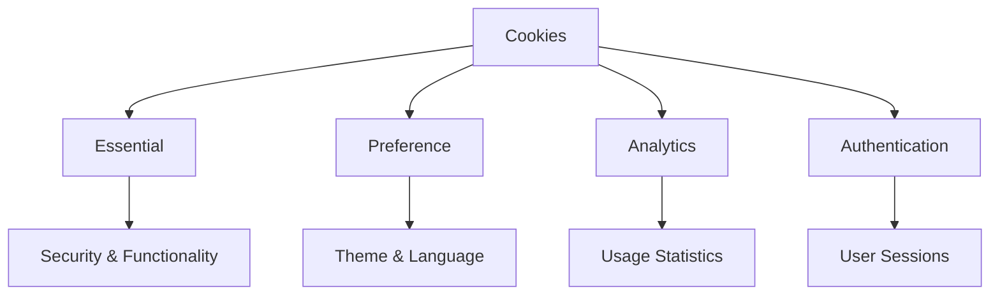

# Cookie Policy

*Last updated: June 2023*

## What Are Cookies

Cookies are small pieces of text sent to your web browser by a website you visit. A cookie file is stored in your web browser and allows the website or a third-party to recognize you and make your next visit easier and the website more useful to you.

## How We Use Cookies

We use cookies for the following purposes:

### Essential Cookies

These cookies are necessary for the website to function properly. They enable core functionality such as security, network management, and account access. You may disable these by changing your browser settings, but this may affect how the website functions.

### Preference Cookies

These cookies enable the website to remember information that changes the way the website behaves or looks, like your preferred language or the region you are in. They also store your theme preferences (light/dark mode).

### Analytics Cookies

These cookies help us understand how visitors interact with our website by collecting and reporting information anonymously. This helps us improve our website.

### Authentication Cookies

These cookies help us identify users who are logged in and maintain their session.

## Third-Party Cookies

In addition to our own cookies, we may also use various third-party cookies to report usage statistics of the website and deliver advertisements on and through the website.

## Managing Cookies

Most web browsers allow you to control cookies through their settings preferences. However, if you limit the ability of websites to set cookies, you may worsen your overall user experience, since it will no longer be personalized to you.

### Cookie Preference Tool

We provide a cookie preference tool that allows you to choose which types of cookies you accept. You can access this tool by clicking the "Manage Cookie Preferences" button in the footer of our website.

### Browser Settings

You can also manage cookies through your browser settings. Here's how to do it in popular browsers:

- **Chrome**: Settings > Privacy and security > Cookies and other site data
- **Firefox**: Options > Privacy & Security > Cookies and Site Data
- **Safari**: Preferences > Privacy > Cookies and website data
- **Edge**: Settings > Cookies and site permissions > Cookies and site data

## Changes to This Cookie Policy

We may update our Cookie Policy from time to time. We will notify you of any changes by posting the new Cookie Policy on this page.

## Contact Us

If you have any questions about our Cookie Policy, please contact us through the contact form on our website.
