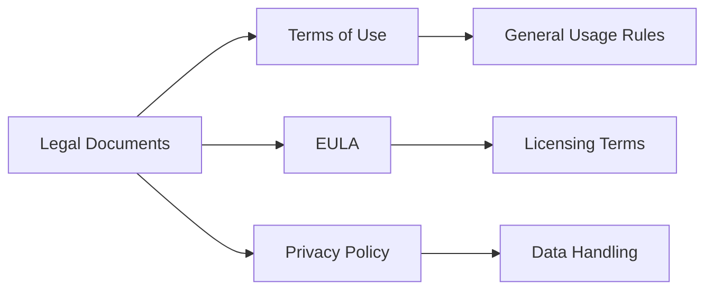

# End User License Agreement (EULA)

*Last updated: June 2023*

## Introduction

This End User License Agreement ("EULA") is a legal agreement between you and the website owner regarding your use of the website and any associated content, features, or services.

## Relationship to Terms of Use

The EULA is complementary to the Terms of Use but focuses specifically on licensing aspects of the website content and services. While the Terms of Use cover general usage rules and conditions, the EULA addresses:

1. The specific license granted to you for using the website content
2. Intellectual property rights
3. Restrictions on usage
4. Distribution limitations

## License Grant

Subject to your compliance with this EULA, we grant you a limited, non-exclusive, non-transferable, non-sublicensable license to access and use the website for personal, non-commercial purposes.

## Intellectual Property Rights

All content on the website, including but not limited to text, graphics, logos, icons, images, audio clips, digital downloads, and software, is the property of the website owner or its content suppliers and is protected by international copyright, trademark, and other intellectual property laws.

## Restrictions

You agree not to:

- Modify, adapt, translate, reverse engineer, decompile, or disassemble any portion of the website
- Remove any copyright, trademark, or other proprietary notices from the website
- Use any automated means to access or collect data from the website
- Use the website for any commercial purpose without prior written consent
- Create derivative works based on the website content
- Distribute, publicly display, or publicly perform any website content

## User-Generated Content

If you submit content to the website (such as comments or feedback), you grant us a worldwide, royalty-free, perpetual, irrevocable, non-exclusive license to use, reproduce, modify, adapt, publish, translate, create derivative works from, distribute, and display such content.

## Termination

This license is effective until terminated. Your rights under this license will terminate automatically without notice if you fail to comply with any of its terms.

## Disclaimer of Warranty

The website is provided "as is" without warranty of any kind, either express or implied, including, but not limited to, the implied warranties of merchantability, fitness for a particular purpose, or non-infringement.

## Limitation of Liability

In no event shall we be liable for any damages arising out of the use or inability to use the website, even if we have been advised of the possibility of such damages.

## Governing Law

This EULA shall be governed by the laws of the jurisdiction in which the website owner is established, without regard to its conflict of law provisions.

## Changes to This EULA

We may update this EULA from time to time. We will notify you of any changes by posting the new EULA on this page.
