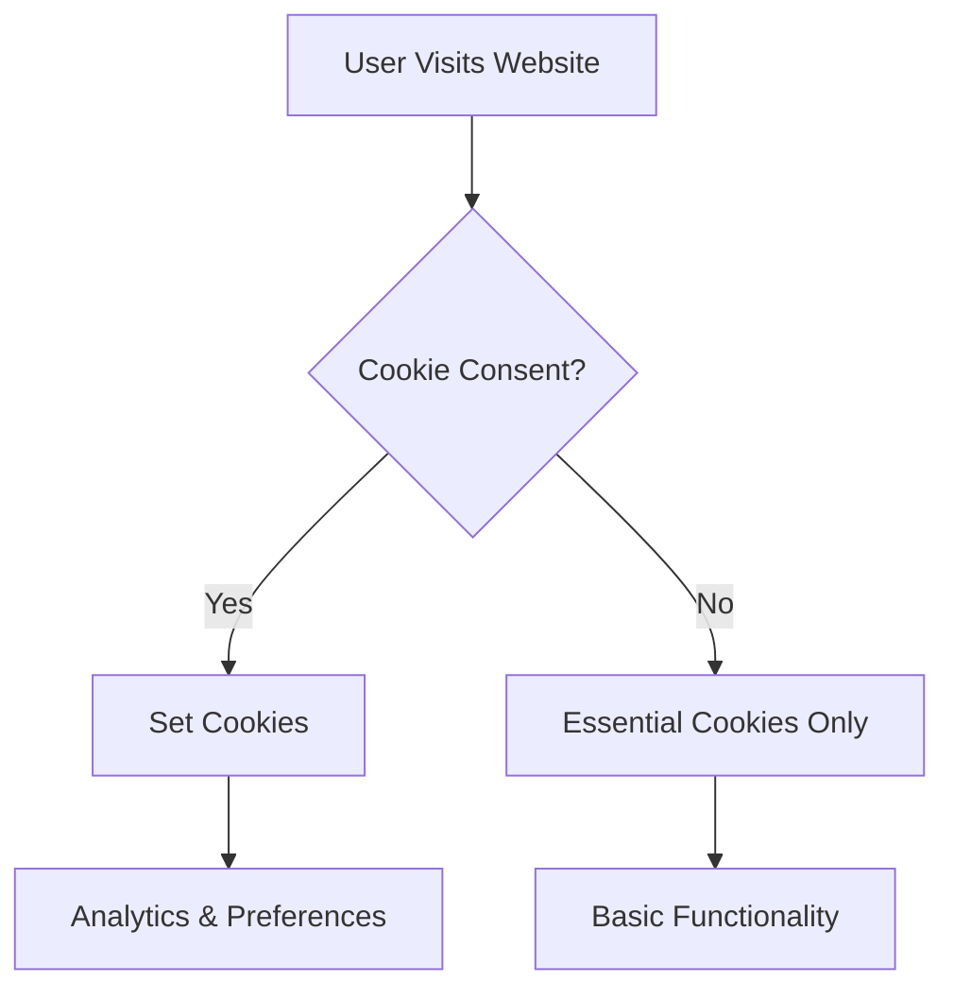

# Privacy Policy

*Last updated: June 2023*

## Introduction

Your privacy is important to us. This Privacy Policy explains how we collect, use, disclose, and safeguard your information when you visit our website.

## Information We Collect

We collect information in the following ways:

### Information You Provide

- **Contact Information**: When you submit the contact form, we collect your name, email address, and message content.
- **Authentication Data**: When you sign in using OAuth providers (Google, GitHub), we receive basic profile information.

### Information Automatically Collected

- **Usage Data**: We collect information about how you interact with our website, including pages visited and time spent.
- **Device Information**: We collect information about your device, including IP address, browser type, and operating system.

### Cookies and Similar Technologies

We use cookies and similar tracking technologies to track activity on our website and hold certain information. Cookies are files with a small amount of data which may include an anonymous unique identifier.

## How We Use Your Information

We use the information we collect for various purposes, including:

- Providing and maintaining our website
- Improving our website and user experience
- Communicating with you
- Analyzing usage patterns
- Detecting and preventing security issues

## Data Security

We implement appropriate technical and organizational measures to protect your personal information from unauthorized access, disclosure, alteration, or destruction.

## Third-Party Services

Our website uses third-party services that may collect information about you. These services include:

- GitHub Pages (hosting)
- Google Analytics (analytics)
- Auth.js (authentication)

## Your Rights

Depending on your location, you may have certain rights regarding your personal information, including:

- Access to your personal information
- Correction of inaccurate information
- Deletion of your personal information
- Restriction of processing
- Data portability

## Changes to This Privacy Policy

We may update our Privacy Policy from time to time. We will notify you of any changes by posting the new Privacy Policy on this page.

## Contact Us

If you have any questions about this Privacy Policy, please contact us through the contact form on our website.
