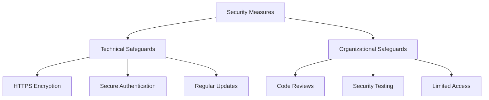

# Security Policy

*Last updated: June 2023*

## Our Commitment to Security

We are committed to ensuring the security of our website and protecting your information. This Security Policy outlines the measures we take to safeguard your data and the steps you can take to help protect your information.

## Security Measures

We implement various security measures to maintain the safety of your personal information, including:

### Technical Safeguards

- **HTTPS Encryption**: All data transmitted between your browser and our website is encrypted using TLS/SSL protocols.
- **Secure Authentication**: We use OAuth 2.0 for authentication, which provides secure delegated access.
- **Regular Updates**: We keep our software and dependencies up to date to address security vulnerabilities.

### Organizational Safeguards

- **Code Reviews**: All code changes undergo review to identify potential security issues.
- **Security Testing**: We regularly test our security measures to ensure they are effective.
- **Limited Access**: Only authorized personnel have access to sensitive information.

## Vulnerability Reporting

If you discover a security vulnerability on our website, we encourage you to report it to us. Please provide:

1. A description of the vulnerability
2. Steps to reproduce the issue
3. Potential impact of the vulnerability

We will investigate all legitimate reports and do our best to quickly fix the problem.

## Data Storage and Protection

- We store minimal user data and only what is necessary for the functioning of the website.
- Authentication data is handled securely through trusted third-party providers.
- We do not store sensitive information such as passwords.

## User Responsibilities

To help protect your information, we recommend that you:

- Use strong, unique passwords for your accounts
- Keep your devices and browsers updated
- Be cautious about clicking on links or downloading attachments
- Sign out of your account when using shared devices
- Review our Privacy Policy to understand how we handle your data

## Changes to This Security Policy

We may update our Security Policy from time to time. We will notify you of any changes by posting the new Security Policy on this page.

## Contact Us

If you have any questions about this Security Policy or if you would like to report a security vulnerability, please contact us through the contact form on our website.
