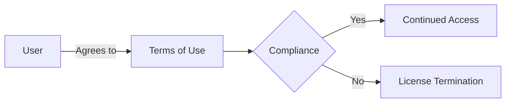

# Terms of Use

*Last updated: June 2023*

## Introduction

By accessing and using this website, you agree to be bound by these Terms of Use, all applicable laws and regulations, and agree that you are responsible for compliance with any applicable local laws.

## Use License

Permission is granted to temporarily view the materials on this website for personal, non-commercial use only. This is the grant of a license, not a transfer of title, and under this license you may not:

- Modify or copy the materials
- Use the materials for any commercial purpose
- Attempt to decompile or reverse engineer any software contained on the website
- Remove any copyright or other proprietary notations from the materials
- Transfer the materials to another person or "mirror" the materials on any other server

This license shall automatically terminate if you violate any of these restrictions and may be terminated at any time.

## Disclaimer

The materials on this website are provided on an 'as is' basis. We make no warranties, expressed or implied, and hereby disclaim and negate all other warranties including, without limitation, implied warranties or conditions of merchantability, fitness for a particular purpose, or non-infringement of intellectual property or other violation of rights.

## Limitations

In no event shall we or our suppliers be liable for any damages (including, without limitation, damages for loss of data or profit, or due to business interruption) arising out of the use or inability to use the materials on this website, even if we or an authorized representative has been notified orally or in writing of the possibility of such damage.

## Accuracy of Materials

The materials appearing on this website could include technical, typographical, or photographic errors. We do not warrant that any of the materials on this website are accurate, complete, or current. We may make changes to the materials contained on this website at any time without notice.

## Links

We have not reviewed all of the sites linked to this website and are not responsible for the contents of any such linked site. The inclusion of any link does not imply endorsement by us of the site. Use of any such linked website is at the user's own risk.

## Modifications

We may revise these terms of service for this website at any time without notice. By using this website, you are agreeing to be bound by the then current version of these terms of service.

## Governing Law

These terms and conditions are governed by and construed in accordance with the laws and you irrevocably submit to the exclusive jurisdiction of the courts in that location.
